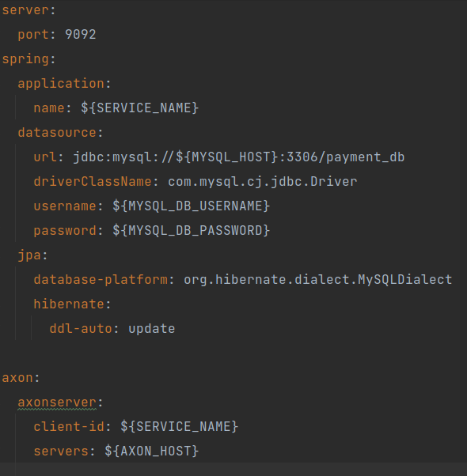

# Payment Service
Payment Service Involves the user verification, and settlement of transactions and on the basis of that executes the PaymentCancelEvent or PaymentApprovedEvent.

## Prerequisites
We must set up Axon Server to handle command and query operations, and configure MySQL as the persistent store destination.



## Local setup
- Setup axon-server and MySQL docker images
```
local-dev > docker compose up -d
```
- Run the application
```
payment-service > mvn clean springboot:run 
```

## Sonar Configuration

We have integrated sonar in our project for inspection of code quality to perform automatic reviews with static analysis of code to detect bugs, code smells, and security.

Execute the following Maven command to run Sonar analysis:
```dtd
mvn clean verify sonar:sonar
```
### Sonar report


## Contributing

Pull requests are welcome. For major changes, please open an issue first to discuss what you would like to change.

Please make sure to update tests as appropriate.